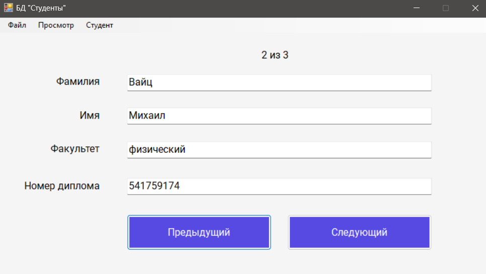

# List-of-students

Данный проект - это приложение для windows, помогающее работать со списком студентов, оно было реализован в рамках лабораторной работы по предмету "Современные языки программирования". Графический интерфейс реализован с помощью Windows Form

## Использование
1. [Скачайте данный репозиторий](https://github.com/Lagertt/List-of-students/archive/refs/heads/main.zip)
2. В корневой папке апустите файл StudentList.exe
3. Для быстрой проверки функционала можно открыть из приложения файл FilledList.xml, в нём лежит уже заполненный небольшой список студентов

## Поддерживаемый функционал
- работа с файлами (сохранение, открытие)
- редактирование списка (добавление нового, удаление, редактирование информации о текущем студенте)
- 2 типа студентов (бакалавр и магист)
- перемещение по файлу (следующий/предыдущий студент, в начало/конец списка)
